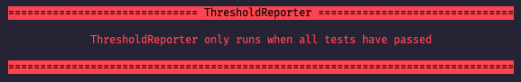

# Custom Logger
___

#### How to install:
``` npm i @tsw38/custom-logger```

#### How to use:

```
const logger = require('@tsw38/custom-logger');

const Log = new logger({header: "<Heading>", delimitor: "|" }).log;

Log('Hello World', 'info');

```

Log options:
`error` - logs the message to the console in red
`info` - logs the message to the console in blue
`warning` - logs the message to the console in yellow
`success` - logs the message to the console in green


Sample Images:
* error

* info
